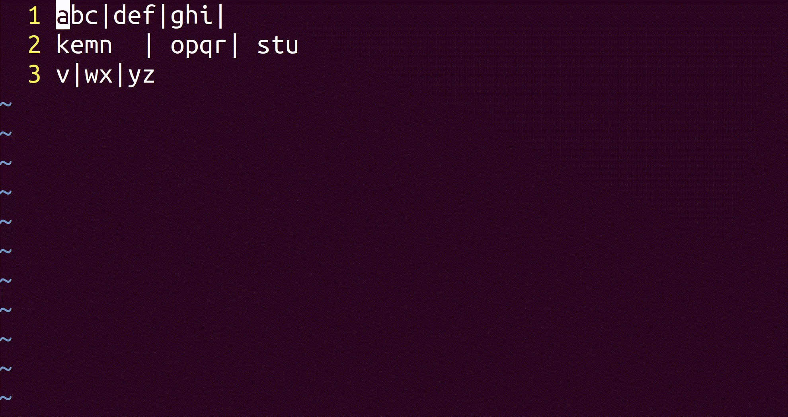

# vim-alignby 
vim-alignby is a vim plug-in which align text date neatly.



# Installation

To install using [pathogen.vim](https://github.com/tpope/vim-pathogen):
```
git clone https://github.com/ppdx999/vim-alignby.git ~/.vim/bundle/vim-alignby
```

To install using [Vundle](https://github.com/gmarik/vundle):
```
" add this line to your .vimrc file
Plugin 'ppdx999/vim-alignby'
```

To install using [Vim-Plug](https://github.com/junegunn/vim-plug):
```
" add this line to your .vimrc file
Plug 'ppdx999/vim-alignby'
```


# Quick tutorial

### Example1

1. select text in V mode.
2. press `<leader>=|`
3. then below things happen.

before
```
aaa|aa|aa|
aaaa|aa|aaaa|
```
after
```
aaa  |aa |aa   | 
aaaa |aa |aaaa | 
```

### Example2

1. select text in V mode.
2. press `<leader>==`
3. then below things happen.

```
5 = 2+3 = 1+1+3
8 = 2+2+1+1 = 1+1+6
```
after
```
5  = 2+3      = 1+1+3 
8  = 2+2+1+1  = 1+1+6 
```

# Redefine Trigger key

To remap the default `<leader>=` trigger key:
```
let g:alignby_leader_key='<C-Y>'
```


# Customize pivot char

To customize pivot char.

Default pivot chars are | | & , # + : ; )

```
let g:alignby_char_list=['\|', '\\', '&', ',', '#', '=', '+', ':', ';', ')', 'y', 'a']
```
